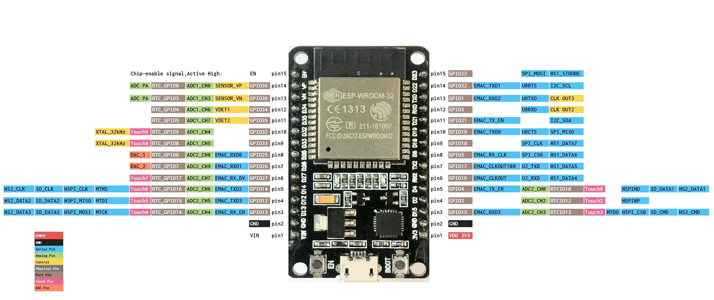

## Getting started

Install the Expressif tools following their online documentation [here](https://docs.espressif.com/projects/esp-idf/en/latest/esp32/get-started/index.html).

It works OK to git clone in /opt using sudo then run the `install.sh` script as normal user.

### Digilent ESP32
PMOD-ESP32 has a 4MB flash and the clock to flash is 40 MHz. To save the firmware that Digilent put in the flash perform the following:

* connect the UART (RX/TX/GND) on header J2 to the programming PC/SBC.
* connecting IO0 (BOOT) is not necessary as we'll use the switch SW1.2.
* power on the PMOD.
* slide switch SW1.2 to ON (BOOT).
* press BTN1 to reset.
* connect the UART at BAUD 115200, it should show something like:
```
   ets Jun  8 2016 00:22:57
   rst:0x1 (POWERON_RESET),boot:0x2 (DOWNLOAD_BOOT(UART0/UART1/SDIO_REI_FEO_V2))
   waiting for download
```
* close the UART and open a terminal and source the IDF's `export.sh`
* run:
```
   esptool.py --port /dev/ttyUSB0 --baud 115200 read_flash 0 0x400000 digilent.bin
``` 
* reading multiple times shows tiny differences in the file. These seem inconsequential as erasing the flash then re-writing any of the binaries restores the Digilent functionality.
* to erase the flash use:
```
   esptool.py --port /dev/ttyUSB0 --baud 115200 erase_flash
``` 
* following erase the chip will boot with the message:
```
   ets Jun  8 2016 00:22:57
   rst:0x10 (RTCWDT_RTC_RESET),boot:0x12 (SPI_FAST_FLASH_BOOT)
   flash read err, 1000
   ets_main.c 371
```
* to restore the original Digilent image run:
```
   esptool.py --port /dev/ttyUSB0 --baud 115200 write_flash --flash_mode dio --flash_freq 40m --flash_size 4MB 0x0 digilent.bin
```
* the Digilent WiFi has AP on IP 192.168.4.1 which can be pinged once connected. 

* could not get AT interface to work with Putty/Minicom (likely a CR/LF issue). Trying Python (make sure serial and pyserial packages are installed) and it seems to work. See [this](./esp32_at_test.py) code.

* SPI interface is on ESP32 dedicate SPI3 bus. According to [this](https://docs.espressif.com/projects/esp-idf/en/latest/esp32/api-reference/peripherals/spi_slave.html) reference the maximum SCLK frequency is 11.4 MHz. See the folder `esp-idf/examples/peripherals/spi_slave` for an example. 

### Amazon ESP32 
The other version of ESP32 is from [Amazon](https://www.amazon.com/gp/product/B08246MCL5). One of the Amazon reviewer posted a link to the pinout description:



#### JTAG hardware debugging
This device has access to the JTAG port pins of the ESP32 so we can perform hardware debug. The guess is that the onboard Silicon Labs CP210x UART bridge is just a UART with no debug capabilities (confirmed by the online search [here](https://community.platformio.org/t/esp32-debugging-with-onboard-cp210/5215)). Notice however that this onboard UART may be more useful for debugging that the TX0/RX0 pins as it has CTS/DTS connected hence can do the soft reset via these extra modem lines.

Using a Digilent HS2 debug dongle connected to JTAG pins (MTMS,MTCK, MTDI, MTDO) and UART0 to TX0/RX0 pins one can do hardware debug (make sure to connect the 3.3v output from ESP32 to the Digilent HS2 VDD pin). 

Modify the JTAG configuration file in the home installation
```
   `which openocd|xargs dirname`/../share/openocd/scripts/interface/ftdi/digilent-hs2.cfg
```
by commenting out `ftdi_device_desc` and add a line to decrease the JTAG clock to 4 MHz because the JTAG is connected via jumper wires
```
   adapter speed 4000
```

Make sure that gdbgui is installed. If not, need to run Expressif install.sh again with
```
   install.sh --enable-gdbgui
```
For gdb to run when called by idf one needs `libpython2.7-dev`, so install it with:
```
   sudo apt install libpython2.7-dev
```
Make sure that no errors occur when running:
```
   idf.py gdb
```

Plug in first the UART0 (will show up as ttyUSB0) then the JTAG dongle (will show up as ttyUSB1 temporarily) then in a working project run:

* set up board for programming (press EN while holding BOOT pressed, then release both), make sure nothing else accesses the UART (either pins or the Silicon Labs one)
```
   idf.py -p /dev/ttyUSB0 flash monitor openocd --openocd-commands "-f interface/ftdi/digilent-hs2.cfg -f target/esp32.cfg" gdbgui
```
* Two configuration files are needed for openocd, one for selecting/configuring the JTAG dongle, the other for setting up the debug target.

* ttyUSB1 should disappear and the terminal will show:
```
   --- idf_monitor on /dev/ttyUSB0 115200 ---
   --- Quit: Ctrl+] | Menu: Ctrl+T | Help: Ctrl+T followed by Ctrl+H ---
   ets Jun  8 2016 00:22:57

   rst:0x3 (SW_RESET),boot:0x3 (DOWNLOAD_BOOT(UART0/UART1/SDIO_REI_REO_V2))
   waiting for download
```
* while the gdb debug window in the browser will show:
```
   JTAG tap: esp32.cpu0 tap/device found: 0x120034e5 (mfg: 0x272 (Tensilica), part: 0x2003, ver: 0x1)
   JTAG tap: esp32.cpu1 tap/device found: 0x120034e5 (mfg: 0x272 (Tensilica), part: 0x2003, ver: 0x1)
   esp32.cpu0: Debug controller was reset.
   esp32.cpu0: Core was reset.
   esp32.cpu0: Target halted, PC=0x500000CF, debug_reason=00000000
   esp32.cpu0: Core was reset.
   esp32.cpu0: Target halted, PC=0x40000400, debug_reason=00000000
   esp32.cpu1: Debug controller was reset.
   esp32.cpu1: Core was reset.
   esp32.cpu1: Target halted, PC=0x40000400, debug_reason=00000000
```
At this point one can write the program again via UART0 Ctrl+T and Ctrl+F then press the EN button and the hardware starts running. One can pause the target using the gdb in the browser Pause button, then add breakpoints, etc. But this is not very useful as a lot of events are lost as `app_main` progresses. Mucking with `monitor reset` was not bery useful. Essentially the issue was that there's no way to break gdb at the start of app_main. So something is done the wrong way!

Indeed, using the onboard Silicon Labs UART and the JTAG dongle provides a different behavior. 
* first plug in the UART, then the JTAG (in this case power from USB is enough and make sure to disconnect VIN from the other power source).
* run the same `flash monitor` command sequence as above.
* gdb is now paused at start of app_main and no extra download/EN push are required
```
   Thread 1 hit Temporary breakpoint 1, app_main () at ../main/hello_world_main.c:29
   29  {
   set breakpoint pending on
```
* to break press Ctrl+] and can send SIGINT to gdb. Also make sure openocd instance shuts down too, otherwise `killall openocd`.

A final note, Digilent HS2 is used for Xilinx FPGA programming/debug too (since the days of ISE), and the udev rules are different to support Digilent onboard and JTAG dongles with FTDI chips. It turns out that the only needed change was:
```
   ACTION=="add", ATTR{idVendor}=="0403", MODE:="666"
```
